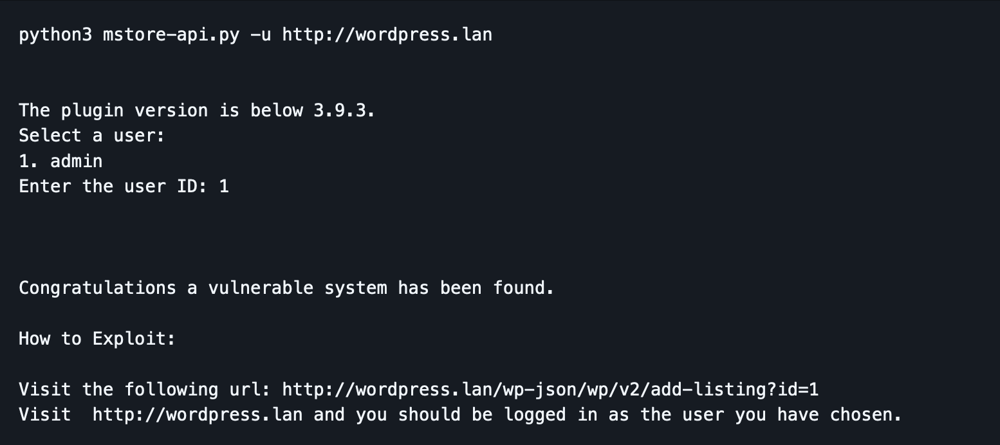
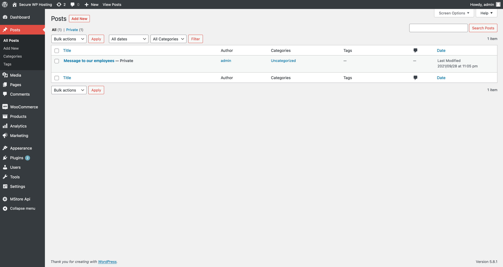
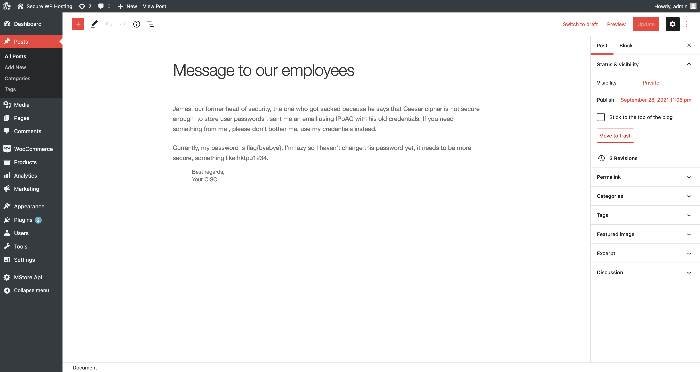
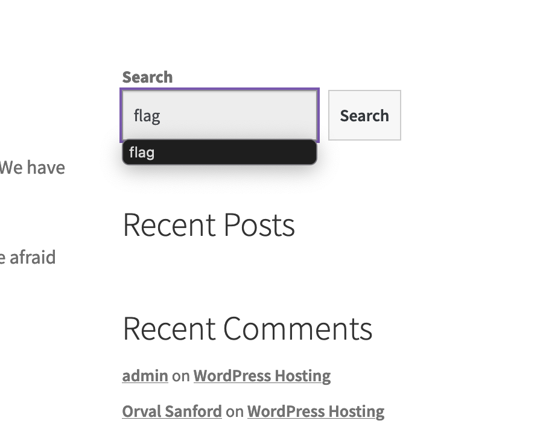
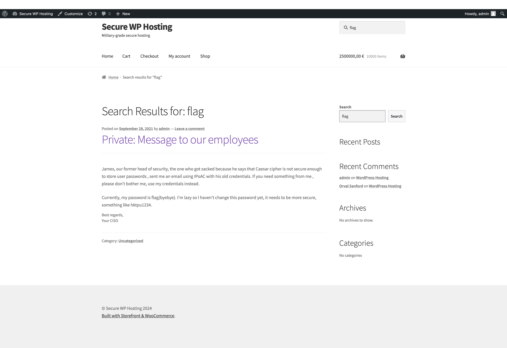

# Exploração de Vulnerabilidades no WordPress e WooCommerce

## Descoberta das Versões

Ao abrir a aplicação web e inspeccionar o código fonte, conseguimos facilmente identificar as versões do WordPress e do WooCommerce.  
Abaixo, mostramos as capturas de ecrã que ilustram a nossa análise inicial:

1. **Versões Identificadas no Código Fonte**
    - Encontrámos as versões do WordPress, MStore API, WooCommerce Plugin e Booster for WooCommerce Plugin na descrição de um artigo do website.  
 
  

 

## Pesquisa de Vulnerabilidades (CVE)

Decidimos, então, procurar CVEs relacionadas com estas versões, focando-nos em vulnerabilidades de login.

### Pesquisa por "MStore API 3.9.0 login exploit"

Ao pesquisar por **"MStore API 3.9.0 login exploit"**, encontramos o **CVE-2023-2732**, que permite explorar esta vulnerabilidade até à versão 3.9.2.  
A falha permite que utilizadores não autenticados obtenham acesso a qualquer conta no website (incluindo a conta de admin), desde que possuam o `user_id` do administrador.

### Informação do Exploit

Obtivemos as instruções para utilizar o exploit encontrado num repositório do GitHub.  

## Execução do Exploit

Utilizando o script Python, executámos o seguinte comando na consola:

$ python3 mstore-api.py -u http://143.47.40.175:5001/

Isso retornou o seguinte output:

http://143.47.40.175:5001/wp-json/wp/v2/add-listing?id=1

À primeira vista, pareceu não acontecer nada, mas ao recarregar a página inicial do website, já estávamos logados como admin.

Exploração no Painel Admin

Com o acesso ao painel de administração, navegámos até à tab "Posts", onde encontrámos um post privado que continha a flag.

flag obtida: flag{byebye}

## Método Alternativo

Poderíamos também ter encontrado a flag utilizando a funcionalidade de pesquisa no site, pesquisando por "flag". No entanto, esse cenário seria irrealista, pois já sabíamos previamente o que estávamos a procurar.

