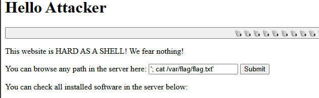
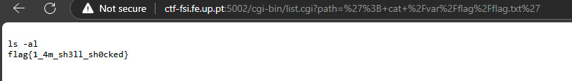

# Vulnerabilidade Shellshock (CVE-2014-6271)

Em 2014, foi descoberta uma vulnerabilidade crítica no **Bash** que permitia a execução de comandos arbitrários num sistema, injetando código malicioso em variáveis de ambiente processadas incorretamente pelo Bash. Esta falha afetava sistemas **Unix** e **Linux** que usavam o Bash como shell. O problema surgia quando o Bash executava, em vez de apenas ler, o conteúdo malicioso das variáveis de ambiente. Isto podia ser explorado remotamente, por exemplo, em servidores web que utilizavam scripts **CGI**, permitindo que atacantes executassem comandos sem autorização.

## Implicações

A vulnerabilidade afeta uma funcionalidade normal do Bash: a execução de comandos encadeados, algo que vamos explorar de seguida.


# Exploração do Sistema e Encadeamento de Comandos

Compreendendo como o **Shellshock** explora o Bash, podemos ver que a injeção de comandos é uma técnica poderosa, tanto para ataques como para a exploração legítima de sistemas. A seguir, apresentamos a sequência de comandos que utilizamos para explorar o sistema manualmente, sem recorrer a vulnerabilidades como o Shellshock, mas utilizando funcionalidades normais do Bash.


## Exploração Inicial do Sistema

Para melhor compreender a estrutura do sistema e os ficheiros que este contém, começamos por testar várias alternativas e comandos. O objetivo era explorar as diferentes pastas e ficheiros no sistema, procurando qualquer indicador que pudesse levar à solução da tarefa.


## Exploração da Diretoria `/var`

Depois de percorrer várias diretórias e listar os seus conteúdos, encontramos uma pasta de particular interesse: **/var**. Ao investigarmos mais, descobrimos dentro desta diretoria uma subpasta chamada **flag**, que continha um ficheiro com o nome `flag.txt`.


## Comandos com o Símbolo `;`

Ao testar diferentes formas de interação com o sistema, percebemos que o uso do símbolo **`;`** permitia encadear múltiplos comandos numa única linha. Este símbolo é um operador que, no contexto de sistemas Unix/Linux, permite executar vários comandos sequencialmente, independentemente do resultado do comando anterior.

Por exemplo, num comando como:

```bash
comando1; comando2

```

O `comando2` será executado imediatamente após o `comando1` terminar, mesmo que este tenha falhado ou dado erro.


## Necessidade de Aspas Simples `'`

Com o uso de aspas simples `'`, conseguimos encapsular o comando de forma a ser interpretado corretamente pelo sistema. Este uso é crucial para comandos mais complexos ou que envolvam caracteres especiais que precisam de ser tratados como literais e não interpretados pelo shell.


## Comando Final

Após realizar as explorações e combinações de comandos com sucesso, chegamos à seguinte solução final para obter o conteúdo do ficheiro `flag.txt`:




- **;** é utilizado para encadear a execução de comandos.
- **cat/var/flag/flag.txt** serve para exibir o conteúdo do ficheiro `flag.txt`.

Esta combinação de comandos permitiu obter o conteúdo da flag no ficheiro desejado e assim completar o desafio.



## Conclusão

A vulnerabilidade **Shellshock** expõe como uma falha de segurança no Bash pode ser explorada para executar comandos arbitrários, de forma semelhante à técnica de encadeamento de comandos com **;** que usamos para executar tarefas no sistema. No nosso caso, utilizamos essa técnica de forma legítima para explorar o sistema e ler o conteúdo do ficheiro `flag.txt`.
