# CTF Semana #5 (Buffer Overflow)

## Análise das proteções do programa

Inicialmente, após fazer download da pasta do CTF 5, analisamos as proteções do programa compilado.
```
$ checksec program
    Arch:       i386-32-little
    RELRO:      No RELRO
    Stack:      Canary found
    NX:         NX unknown - GNU_STACK missing
    PIE:        No PIE (0x8048000)
    Stack:      Executable
    RWX:        Has RWX segments
    Stripped:   No
    Debuginfo:  Yes
```
Apesar do `checksec` revelar que o binário contém um canário, é nos revelado no enunciado do CTF que o ataque funcionará com ou sem canário. Desta forma, não é necessário fazer nada em relação às proteções do programa.

## Análise do código-fonte

Após analisar o código-fonte, verificamos que o programa abre e lê um ficheiro (rules.txt) através da função `readtxt`, que lê um ficheiro de texto, com um nome dado por input, através do comando `cat`. 
<br> 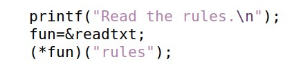 <br>
Ao analisar o resto do código:
<br> 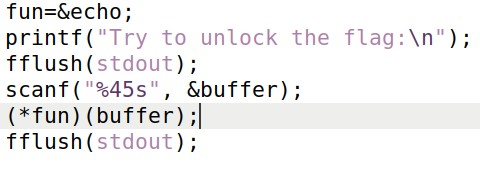 <br>
Após ler o ficheiro, o programa muda o apontador de `readtxt` para `echo`, uma função que apenas imprime uma string dada no argumento, com "Echo " antes da mesma.
De seguida, é pedido por input uma string que pode ter até 45 caracteres, que será colocada no buffer com capacidade de apenas 32 bytes. Sendo assim, verifica-se um buffer-overflow. Após esta linha, é chamada a função que `fun` aponta, com o buffer como input. Geralmente, isto iria dar `echo` ao input dado, porém, devido ao buffer-overflow, é possivel trocar o apontador `fun` da função `echo` para a função `readtxt`, que nos permitiria ler um ficheiro, com o input que colocamos no buffer. Assim, como o endereço de `fun` se encontra imediatamente após o buffer (num endereço mais alto) e como exite um buffer-overflow, será possível escrever na stack após o endereço de memória do buffer, mudando assim o endereço para que `fun` aponta para a função pretendida `readtxt`. Assim, apenas precisamos de garantir que a função `readtxt` lê a string "flag", para poder mostrar o conteúdo de `flag.txt`.
<br> 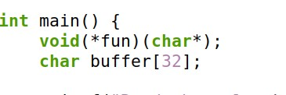 <br>

## Encontrar o endereço de `readtxt`

Para encontrar o endereço de memória de `readtxt`, usamos o gdb:
<br> 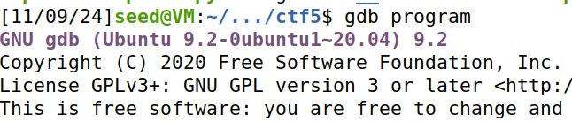 <br>
<br> 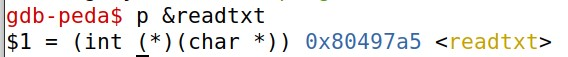 <br>
Assim verificamos que a função está no endereço `0x80497a5`.

## Execução do exploit

Inicialmente, através do `exploit-template.py`, procuramos uma forma de passar a string "flag" como input no buffer, de forma a que seja possível adicionar mais bytes "lixo" para podermos adicionar o endereço de `readtxt` encontrado após os 32 bytes do buffer, de forma a que `fun` execute a função que pretendemos.
<br> 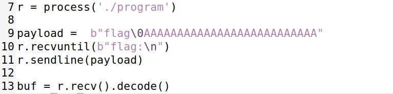 <br>
Ao adicionar o byte `\0` após "flag", vai terminar a string, pelo que podemos adicionar bytes "lixo" à frente sem que eles sejam impressos pelo `echo` (função que `fun` aponta antes do exploit).
<br> 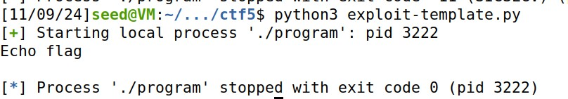 <br>
Agora, necessitamos de mudar o apontador de `echo` para `readtxt`. Para isso, adicionaremos o endereço da função pretendida no final dos 32 bytes do buffer, de forma a alterar o endereço que `fun` aponta. Necessitamos de adicionar o endereço em little endian, pelo que usamos a função `p32` para fazer a conversão.
<br> 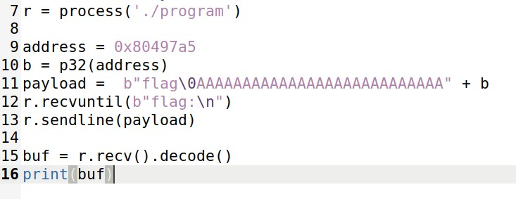 <br>
Ao correr o script em python, verificamos que o programa executou a função `readtxt` com o argumento "flag", pelo que leu o conteúdo do ficheiro `flag.txt`, que é `flag{test}`.
<br> 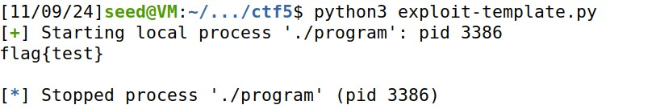 <br>
De seguida, aplicamos o exploit no servidor:
<br> 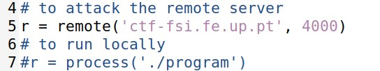 <br>
<br> 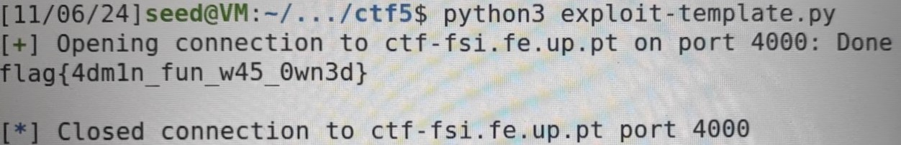 <br>

## Conclusão

Através da análise do código-fonte e da exploração do buffer overflow, conseguimos redirecionar a execução do programa para a função `readtxt` ao sobrescrever o ponteiro `fun` na stack. Isso permitiu que o programa abrisse e lesse o ficheiro `flag.txt`, revelando o conteúdo desejado. Este tipo de vulnerabilidade destaca a importância de práticas de segurança como o uso de canários, mas também ilustra como, mesmo com essas proteções, um atacante pode explorar falhas na gestão de buffers para comprometer a execução de programas.